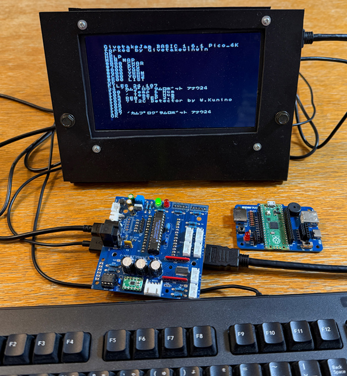

# GivetakeJam BASIC  
### Extended IchigoJam BASIC for Raspberry Pi Pico


-16114-brightgreen)


## Overview / 概要

**GivetakeJam BASIC** is an extended version of IchigoJam BASIC for Raspberry Pi Pico.

This firmware enhances program capacity, expands array variables, improves external EEPROM handling, and adds both NEC infrared reception and environmental sensing commands while maintaining compatibility with the original IchigoJam BASIC design.

**GivetakeJam BASIC** は Raspberry Pi Pico 向け IchigoJam BASIC の拡張版です。  
プログラム容量の拡張、配列変数の拡張、外部 EEPROM 対応の改善、NEC 赤外線受信コマンドと環境測定コマンドの追加を行い、従来の IchigoJam BASIC との互換性を維持しています。

## Version / バージョン

- `16100` : original base version
- `16112` : infrared receiver build
- `16114` : environmental measurement build

## Highlights / 主な特徴

- 4096-byte program size
- 25 internal storage slots
- Extended arrays `[0]..[357]`
- `VAR2` area at `#C00`
- `IR.IN` NEC infrared receiver command
- `ENV.IN` AHT20 + BMP280 environment sensor command
- External EEPROM support (`24LC64` / `24LC256` / `24FC1025`)

## Memory Map

```text
#000 CHAR
#700 PCG
#800 VAR
#900 VRAM
#C00 VAR2
#E00 LIST
```

## Screenshots

### Runtime Environment


### Display Examples


### Compatible Board


## Main Documents

- English: `README.md`
- Japanese: `README_JA.md`
